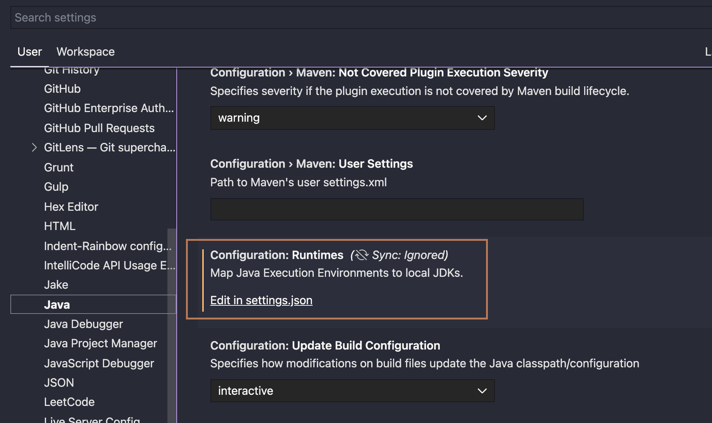

# 在VSCode中Clone、导入然后运行Maven项目

因为你已经通过了之前的`git version`挑战，`git`应该已经正确安装，所以在你的终端（如`Terminal`/`git-bash`/`cmd`等）输入：

`git clone https://github.com/ByteLegendQuest/java-clone-switch-branch`

如果碰到问题（超时，SSL异常或者下载缓慢），请尝试国内镜像：

`git clone https://git.bytelegend.com/ByteLegendQuest/java-clone-switch-branch`

这会在本地创建一个名为`java-clone-switch-branch`的项目文件夹，你可以把它移动到你喜欢的任何地方去。

打开`VSCode`，将刚才 Clone 下来的项目拖入VSCode中。请确保已经安装了
[Extension Pack for Java](https://marketplace.visualstudio.com/items?itemName=vscjava.vscode-java-pack)。如果你之前没有在VSCode中配置过JDK，则点击侧边栏中的齿轮，选择`Settings`，在页面中找到`Configuration: Runtimes`配置，点击`Edit in settings.json`。



按照如下格式进行 JDK 的配置：

```json
"java.configuration.runtimes": [
  {
    "name": "JavaSE-17",  // JDK 名称
    "path": "~/.sdkman/candidates/java/17.0.2-tem", // JDK 路径
    "default": true // 是否为默认值
  }
]
```


如果你没有魔法，项目的导入可能会很慢，这是因为默认的Maven中央仓库在中国大陆没有CDN节点。
在你了解Maven原理之前，**请勿**贸然按照网上教程胡乱修改本地的Maven配置。
我们在项目中内置了阿里云镜像，一键开启，只对该项目生效，没有毒副作用。

打开本项目中的`.vscode/settings.json`文件，将`maven.executable.options`这行前面的注释（`//`）去掉，
关闭VSCode重新打开项目即可。


